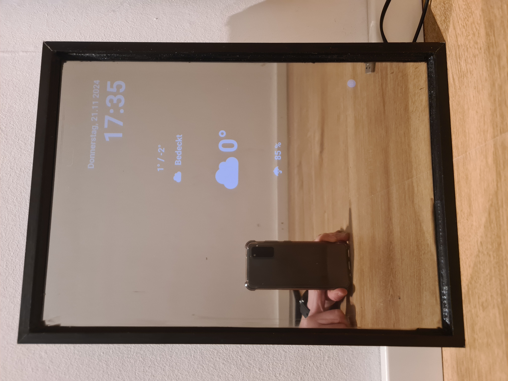

# Smart Mirror (on a budget)

<div style="display: flex; width: 100%; align-items: center;">
  <!-- Text on the Left -->
  <div style="flex: 1; padding-right: 20px;">
    <p>
      This project aims to create a cost-effective smart mirror that displays useful information, such as weather data. It utilizes an old tablet or smartphone, combined with simple hardware materials, to create a sleek, modern smart mirror for your home.
    </p>
  </div>
  <!-- Image on the Right -->
  <div style="flex: 1; display: flex; justify-content: flex-end;">
    
  </div>
</div>


## Key Features
- **Weather Display**: Real-time weather information, including temperature, humidity, and forecasts.
- **Time and Date**: Display the current time and date with a customizable format.
- **Smart Mirror Functionality**: The mirror displays useful data on top of the reflective surface, turning any room into a functional and stylish smart hub.


## Materials
| **Item**                         | **Description**                                                                                           | **Amount** | **Requirement** | **Estimated Cost**    |
| -------------------------------- | --------------------------------------------------------------------------------------------------------- | ---------- | --------------- | --------------------- |
| Tablet or Smartphone             | Acting as the display for the smart mirror. Most people have one lying around or you can buy refurbished. | 1          | Needed          | Varies (e.g., 0-200€) |
| Picture frame                    | To house the tablet/smartphone                                                                            | 1          | Needed          | <10€                  |
| One-way privacy film for windows | To turn the glass into a reflective mirror surface                                                        | 1          | Needed          | <10€                  |
| M2/M3 screws                     | For mounting and securing the frame. Pick the screw size according to the size of the frame borders       | 4          | Needed          | 1-3€                  |
| Charging cable                   | To power the device                                                                                       | 1          | Needed          | 3-10€                 |
| Additional piece of wood         | Cut to the size of the picture frame                                                                      | 1          | Needed          | <10€                  |
| Black paint                      | To paint the additional piece of wood if it has a light color                                             | 1          | Optional        | 5-10€                 |
| Frosted privacy film for windows | For enhanced privacy or aesthetics                                                                        | 1          | Optional        | <10€                  |
| Smart Plug                       | For intelligent charging control                                                                          | 1          | Optional        | 10-30€                |

This is just an estimate of the potential material costs. Many of these items can be sourced from spare parts. For example, I used an old tablet that I wasn't using anymore, and with the smart plug, my total costs came to less than 40€.

## Prerequisites 
- Running MQTT Broker

## Hardware Setup
1. **Prepare the Glass**
   
   Begin by carefully removing the glass from the picture frame and laying it flat on a smooth surface. Apply the One-way privacy film according to the manufacturer’s instructions. It’s recommended to allow the film to rest for at least 6 hours to ensure proper adhesion.

2. **Prepare the Wooden Frame**
   
    If you haven’t already, cut the additional piece of wood to match the dimensions of the picture frame. Once cut, smooth the edges by sanding them down, and paint the wood in a dark (preferably black) color so the one-way privacy film can work. Let the paint dry thoroughly.

3. **Drill Holes for Assembly**

    Drill four holes at the corners of the wooden piece as well as into the picture frame, ensuring they are equally spaced. These holes will allow you to attach the two parts securely and "close" the frame, with the black side facing inward. Drill another hole to fit the charging cable through.

4. **Reassemble the Frame**

    Once the paint is dry, carefully place the glass back into the frame, ensuring that the one-way privacy film is facing outward. At this point, follow the software setup instructions before proceeding further.

5. **Insert the Device**

    Place your smartphone or tablet inside the frame, ensuring it is angled correctly so that you can easily view the information when the mirror is in its final position. Take care to position the device in a way that maximizes readability.

6. **Connect the Charging Cable**

    Attach the charging cable to your device. If you're using a smart plug, configure it to ensure the device is charged for at least 6 hours per day. Depending on your usage, you may need to adjust this charging schedule.

7. **Optional Stabilization**

    If there is extra space inside the frame and your device is able to move around, you can use small wooden pieces or 3D-printed parts to stabilize the device in place. You can find 3D print files for this in the `assets/models` folder or modify them to fit your setup.

8. **Secure the Frame**

    Finally, screw the wooden piece onto the back of the picture frame to "close" it, ensuring everything is tightly secured.

9. **Enjoy Your Smart Mirror**

    Your smart mirror is now ready for use! Have fun and enjoy your new, high-tech addition to your space.

<p align="center">


</p>

## Software Installation & Setup

1. **Deploy the Angular Project**

    Follow the [instructions](./website.README.md) to deploy the Angular project from this repository to your device or server.

2. **Install Wallpanel on Your Device**

    Download and install the [Wallpanel](https://play.google.com/store/apps/details?id=xyz.wallpanel.app&hl=de&pli=1) app on your smartphone or tablet.

    > Note: I do not own or develop Wallpanel. This guide is based on v0.12.0 of Wallpanel, and future versions may differ slightly.

3. **Configure Wallpanel**

Open the Wallpanel app and navigate to the settings (bottom-right corner). Change the dashboard URL to the address of the website you deployed in Step 1.

4. **Choose Your Smart Mirror Setup**

    Decide how you want your smart mirror to behave:

   - **Motion-Activated Display**: If you’d like the smart mirror to turn on automatically when someone walks in front of it, enable the camera in Wallpanel settings under “Camera Settings” and switch to the front camera. Then, go to “Motion Detection” and enable it, along with the “Wake Screen” option. To ensure privacy, I recommend covering the camera with a small piece of frosted privacy film.

   - **Always-On Display**: If you prefer the mirror to stay on at all times, simply enable the "Stay On" option in Wallpanel settings, bypassing the motion detection feature.

5. Fetch Weather Data

    Download the shell script located at `scripts/weather-today.sh`. This script retrieves weather data from the German weather provider wetter.com and uses regex to extract today's forecast.

    To use the same provider:

    1. Visit wetter.com and search for the desired location.
    2. Copy the URL of the location's weather page and replace the default URL in the script.
    3. Update the MQTT broker details in the script to match your setup.
   
   If you're using different provider you'll probably have to adapt the script. Ensure all changes are saved before running a test with:
   ```bash
   sh weather-today.sh
   ```
   > Note: Make sure you have an mqtt publisher available (e.g [mosquitto](https://mosquitto.org/)) and to set the environment variables to the websocket listener. 

6. Update Weather Data

    To continuously update the weather data, you can set up a cron job to execute the shell script at regular intervals, such as every 15 minutes:
    ```bash
    0,15,30,45 * * * *    pi   /etc/cron.d/weather-today.sh 
    ``` 
    Ensure the shell script is placed in the `cron.d` directory and has executable permissions. Adjust the timing or file paths as needed for your specific setup.